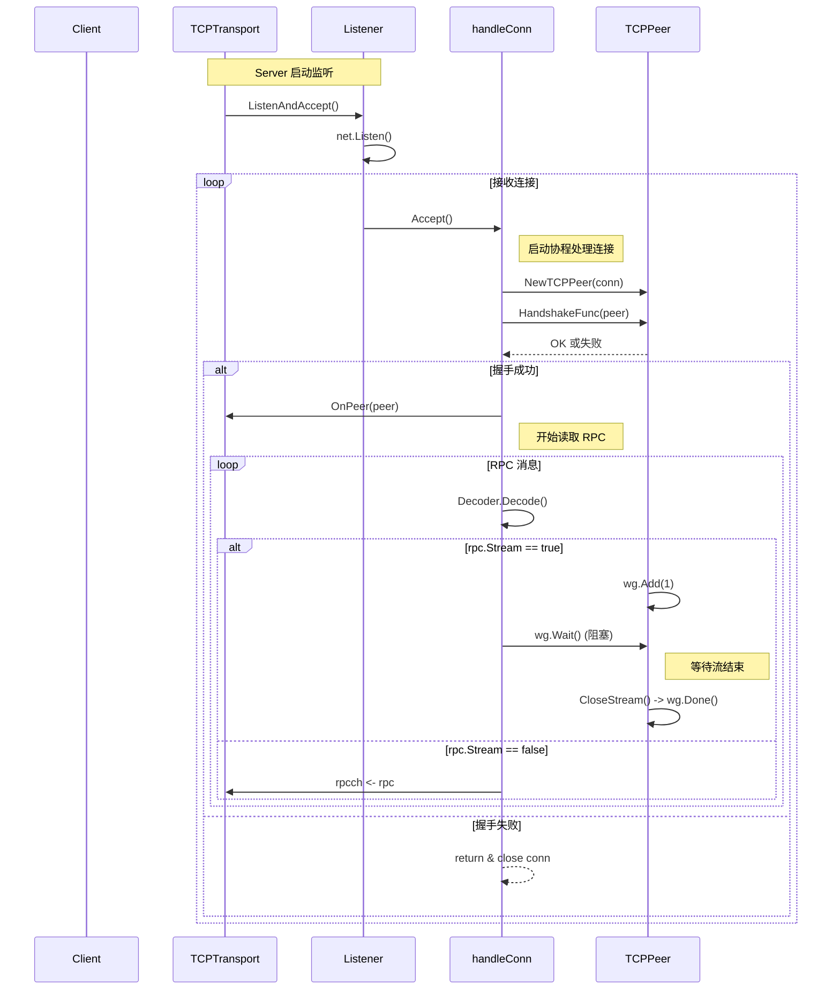

## 📂 GDSS FileServer

GDSS FileServer 是一个基于 P2P 的加密文件存储与分发系统，具备节点间自动同步、流式传输、加密存储等能力，适用于分布式文件备份、内容分发等场景。

---

## ✨ 特性一览

* 🔗 点对点文件同步（P2P）
* 🔐 本地磁盘加密存储（AES）
* ⬆️ 支持加密上传（Store）和下载（Get）
* 📣 自动广播文件事件，确保数据一致性
* ⚙️ 插件化传输层，可定制协议实现
* 🧭 支持路径转换函数（PathTransformFunc）

---

## 🗂️ 项目结构

```bash
gdss/
├── server/      # 核心服务逻辑（Get、Store、广播）
├── store/       # 加密存储与文件管理
├── p2p/         # 网络模块（Transport、Peer）
├── gcrypto/     # 加解密与 ID 生成
├── log/         # 日志封装
```

---

## 🚀 快速开始

```bash
make run
```

默认会启动单节点服务。如需多节点测试，请手动指定端口、节点 ID、数据目录。

---

## 🧩 设计说明

### 🔐 加密存储

* 文件写入：`gcrypto.CopyEncrypt` 进行加密
* 文件读取：自动解密并返回 `io.Reader`

### 📡 P2P 通信

* 使用 Gob 进行 RPC 消息序列化
* 广播机制（广播文件存在通知）由 `Broadcast()` 实现
* 支持传输文件数据流（streaming）

---

### 📡 TCP Transport 模块

TCPTransport 实现基于 TCP 的传输协议，负责节点监听、连接握手、消息解码与数据流同步。

#### 核心组件

| 组件            | 描述                  |
| ------------- | ------------------- |
| TCPTransport  | 网络传输抽象，统一监听、连接管理等功能 |
| TCPPeer       | 表示一个连接对端，封装读写与流控制   |
| handleConn    | 每个连接的处理入口，完成握手与数据接收 |
| Decoder       | Gob 解码器，解码 RPC 消息结构 |
| HandshakeFunc | 用户自定义的身份验证逻辑        |

---

#### ⏱️ 工作流程时序图



### 🌊 流式传输

* 读取时通过 `IncomingStream` 判断是否为流起始
* `stream.Write()` 包括长度前缀与加密数据
* 解密使用 `io.LimitReader + gcrypto.DecryptReader`

---

## 🧪 测试建议

* 启动 2-3 个节点，模拟断网/恢复
* 多节点上传同一文件测试去重逻辑
* 高并发上传/下载测试流量控制
* 校验加密一致性和存储完整性

---

## ⚠️ 注意事项

* `EncKey` 长度应满足算法要求（如 AES-256 需 32 字节）
* 当前传输层仅为演示实现，未做完整重试与超时控制
* 所有网络 RPC 均为阻塞处理，建议合理规划 goroutine 使用

